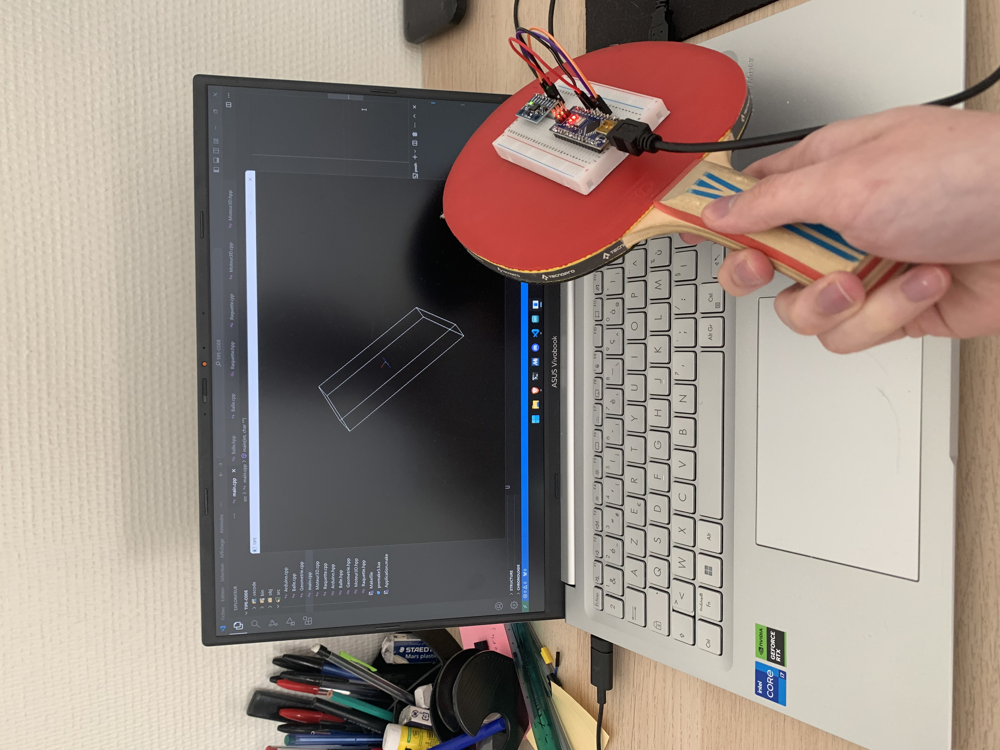
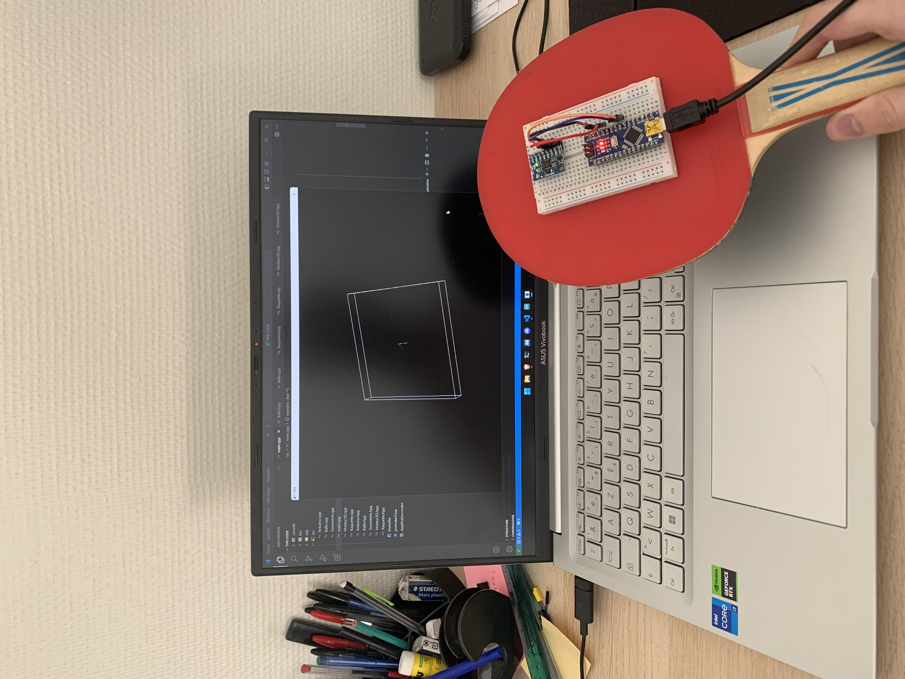
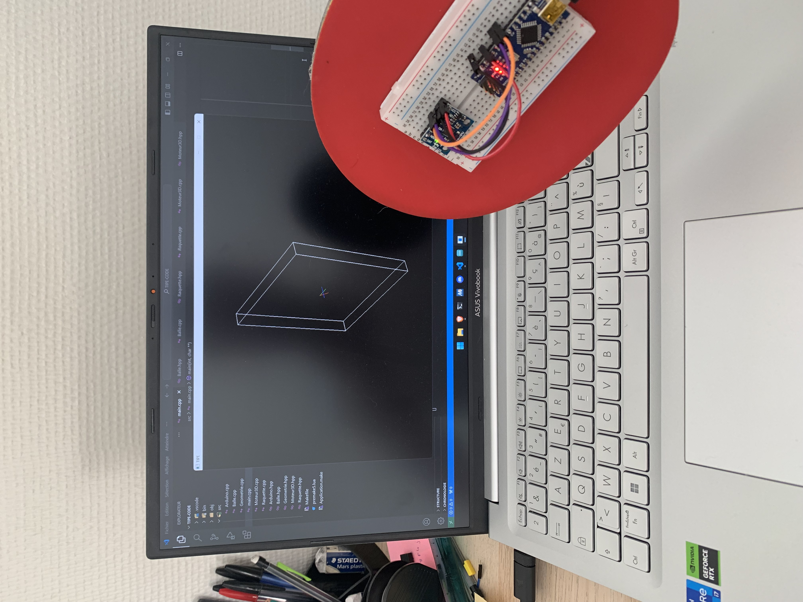

# TIPE
Code C++ de mon TIPE sur le thème "jeux et sports", sujet "Interaction d'une raquette connectée avec un environnement
virtuel". 

Ce programme lit les données d'un capteur MPU6050 (accéléromètre et gyroscope) connecté à une Arduino, le tout fixé sur une raquette. Il met ensuite à jour la position d'un pavé droit représentant la raquette. 

Une interaction basique entre une balle et de la raquette est aussi implémentée.

## Dépendances
Nécessite un environnement de développement C++ classique, [premake5](https://premake.github.io/) ainsi que les bibliothèques [SDL2](https://libsdl.org/) et [Eigen3](https://eigen.tuxfamily.org/).

Il peut être nécessaire de modifier le fichier `premake5.lua` selon le répertoire d'installation des bibliothèques.

Compilation et tests réalisés avec une installation de [msys2](https://www.msys2.org/) (environnement UCRT64).

## Compilation et exécution

([Compatible avec d'autres types de projets](https://premake.github.io/docs/Using-Premake))

### Debug
`premake5 gmake2 && make config=debug && ./bin/Debug/Application.exe`
### Release
`premake5 gmake2 && make config=release && ./bin/Release/Application.exe`

### Éxecution
Tel qu'écrit le programme ne fonctionne que si une Arduino est connectée au port `COM3` de l'ordinateur. De plus le programme lit les données du MPU6050 dans un format bien précis (voir le sketch Arduino pour le format du texte envoyé).

## Résultats

